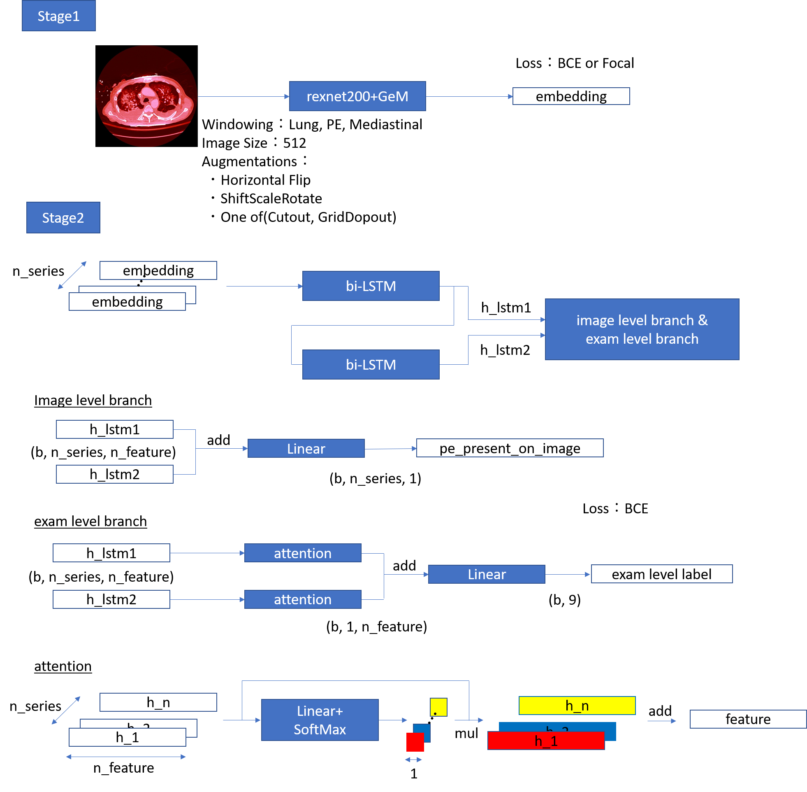

# RSNA STR Pulmonary Embolism Detection 4th place solution
This is the source code for the 4th place solution to the kaggle [RSNA STR Pulmonary Embolism Detection](https://www.kaggle.com/c/rsna-str-pulmonary-embolism-detection/overview)

## Solution Overview


## Solution Detais
Please read [this post](https://www.kaggle.com/c/rsna-str-pulmonary-embolism-detection/discussion/193970) on Kaggle Discussion.

## Hardware
I used NVIDIA DGX Station.

## Requirement
I recommend using docker.

## How to use

### Build docker
```
$ docker build ./docker -t kaggle:rsna2020
```

### Data download
Please download competition data from [kaggle](https://www.kaggle.com/c/rsna-str-pulmonary-embolism-detection/data) and put them to ./data and unzip them.

### Make jpeg image from dicom
```
$ python src/make_image.py
```
./data/train-jpegs-512 will be created.

### Split train data
```
$ python src/make_csv.py
```
./data/fold/ver1/train-jpegs-512/train.csv will be created.

### Train CNN backbone
```
$ ./run_train_cnn.sh
```
This command trains 6 CNN backbones.  
(3-fold rexnet200 trained with BCE + 3-fold rexnet200 trained with Focal)  
checkpoint will be saved at ./wandb

### Make npz file which put jpeg series of study level together.
For speedup of next dump embedding step, gather jpeg series of study level into one npz file.
```
$ python src/make_npz.py
```
./data/npz/train-jpegs-512 will be created.

### Dump embeddings
Please set checkpath path of trained backbone to ./configs/dump_embeddings/*.yml  
After that
```
$ ./run_dump_embeddings.sh
```
This command dumps embeddings of 6 CNN backbones.  
./dump/v1/rexnet200_(BCE or focal)/fold_(0~3) will be created.

### Train LSTM head
```
$ ./run_train_rnn.sh
```
This command trains 6 LSTM head.  
checkpoint will be saved at ./wandb

### Inference
Please set checkpath path of CNN backbone & LSTM head to ./configs/inference.yml  
After that
```
$ python src/inference.py
```
This command inference for test data.
./output/inference/rexnet200/submission.csv will be created.

## Note
* If you want to change training setting, please revise yml file in ./configs directory.
* [Weight & Biases](https://www.wandb.com/) is used for visualization of results, but sync is off at default.  
  If you want to sync the result to Weight & Biases server automatically, please change yml file like below.  
  ```
  offline:True -> offline:False
  ```